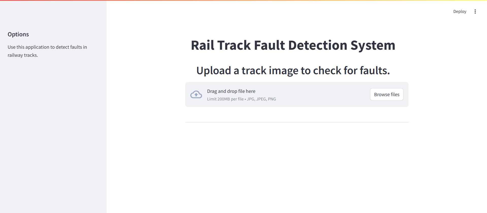

# Rail Track Fault Detection System

  
*Figure 1: User interface for uploading rail track images.*  

  
*Figure 2: Example of a detected fault in a rail track.*  

## Project Description
This project aims to detect faults in rail tracks using advanced machine learning techniques. It provides real-time monitoring and visualization of detection results, ensuring safety and efficiency in rail transport.

## Features
- Real-time fault detection
- Visualization of detection results
- Machine learning model integration

## Cost-Benefit Analysis
### Manual Track Fault Detection
- **Limitations**: 
  - High labor costs
  - Time-consuming processes
  - Potential for human error

### Automated Detection System
- **Benefits**:
  - Reduced labor costs
  - Increased accuracy
  - Faster detection times
  - Overall efficiency improvements

## Installation Instructions
To set up the project locally, follow these steps:
1. Clone the repository:
   ```
   git clone https://github.com/paragnema1/Rail_Track_Fault_Detection_System.git
   ```
2. Navigate to the project directory:
   ```
   cd Rail_Track_Fault_Detection_System
   ```
3. Install the required dependencies:
   ```
   pip install -r requirements.txt
   ```

## Usage
To run the application, execute the following command:
```
python app.py
```
Follow the on-screen instructions to use the fault detection features.

## Contact Information
For inquiries, please reach out to [Parag Nema](https://www.linkedin.com/in/parag-nema).
